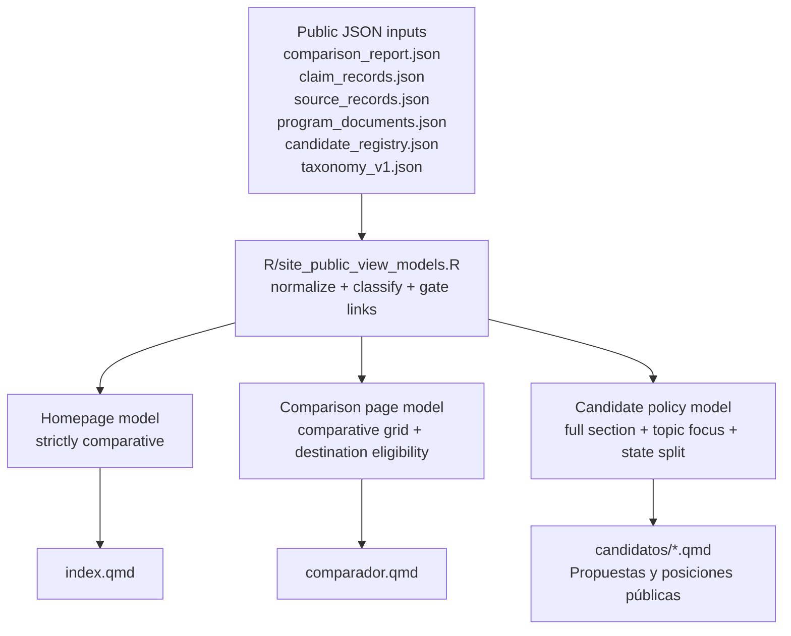
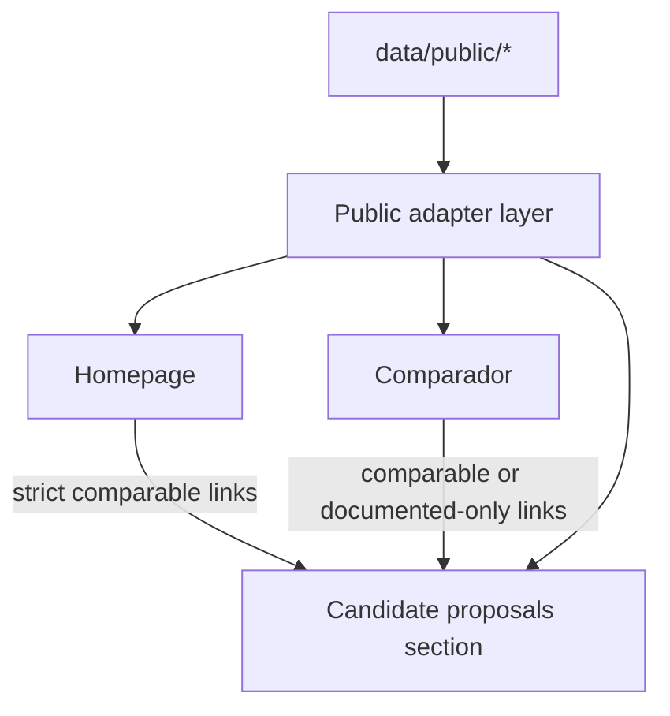

# feat: Extend artifact-driven public contracts to comparador and candidate proposals

## Overview

Extend the `homepage-first` adapter pattern to the comparison page and the `Propuestas y posiciones públicas` section of candidate pages so those surfaces consume consistent public contracts instead of reading legacy processed tables directly. The implementation should preserve the current editorial split across surfaces: homepage remains strictly comparative, the comparison page remains the main comparative workspace, and the candidate page becomes a supported destination that can distinguish between comparable proposals and documented-but-not-yet-comparable proposals.

## Problem Frame

The current site is asymmetric. Homepage rendering already runs through a public adapter derived from `homepage_brief`, `comparison_report`, and `validation_report`, but `comparador.qmd` still renders directly from `comparison_report` plus processed tables for enrichment, and candidate pages still assemble policy sections from legacy tables such as `claim_records.csv` and `source_records.csv`. That makes the cross-surface navigation contract weaker than the homepage contract and leaves the proposals destination vulnerable to mismatched semantics.

This plan implements the next bounded slice from the origin requirements doc: `comparador-first` with a supported destination in the candidate page up to `Propuestas y posiciones públicas`, while explicitly leaving `Análisis lógico publicado` and full-profile migration for later (see origin: `docs/brainstorms/2026-04-23-artifact-driven-comparador-fichas-requirements.md`).

## Requirements Trace

- R1-R3. Treat the work as `comparador-first`, include only the candidate proposals destination, and keep `Análisis lógico publicado` out of primary scope.
- R4-R6. Govern the comparison page with `comparison_report` plus a public adapter layer, and govern the candidate proposals section with a web-specific derived view-model rather than `candidate_analysis` or editorial packages.
- R7-R9. Preserve whole-section landing behavior with topic focus so the destination still feels like a candidate page.
- R10-R12. Separate comparable proposals from documented-but-not-yet-comparable proposals in the candidate surface.
- R13-R16. Keep homepage link rules stricter than comparison page rules, and make destination status explicit at landing.

## Scope Boundaries

- Full migration of candidate pages remains out of scope; header, ideology, background, source library, and `Análisis lógico publicado` stay on their current contracts.
- This plan does not introduce a new pipeline stage or a new persisted public schema in `schemas/`; it extends the existing render-time public adapter layer first.
- Homepage layout and storytelling remain materially unchanged beyond link eligibility and destination semantics already implied by the origin document.

### Deferred to Separate Tasks

- Formalizing a persisted schema for comparison-page or candidate-policy view-models if the render-time builders prove stable enough to deserve their own public contract.
- Migrating `Programa oficial` and other non-proposal candidate sections off their current inputs.
- Re-scoping `candidate_profile` editorial packages or `candidate_analysis` for public analytical consumption.

## Context & Research

### Relevant Code and Patterns

- `R/site_public_view_models.R` already holds the homepage adapter pattern, including normalization helpers, evidence-state classification, safe degradation, and handoff generation.
- `index.qmd` consumes `build_homepage_view_model()` and keeps homepage link and copy decisions at the view-model boundary instead of scattering them through multiple data reads.
- `comparador.qmd` currently reads `comparison_report.json` directly and renders via `emit_comparison_sections(...)`.
- `R/site_helpers.R` currently renders comparison and candidate policy sections from raw tables and unstructured lists rather than surface-specific view-models.
- `R/site_generation.R` owns the generated candidate-page template, so candidate contract changes should land there first and then be regenerated into `candidatos/*.qmd`.
- `R/pipeline.R` already publishes the public JSON needed for this slice: `claim_records.json`, `source_records.json`, `program_documents.json`, `comparison_report.json`, `candidate_registry.json`, and `taxonomy_v1.json`.
- `tests/testthat/test-site-public-view-models.R` is the strongest local pattern for adapter-level contract tests and safe-degradation regression coverage.
- `tests/testthat/test-site-generation.R` is the current pattern for locking page template behavior to adapter-driven rendering.

### Institutional Learnings

- No matching file was found under `docs/solutions/` for this slice. The practical institutional baseline is the existing homepage adapter implementation and its regression tests.
- The origin requirements doc is the authoritative source for product semantics in this plan.

### External References

- None. Local patterns are already strong enough for this slice, and the main risk is contract design inside the repo rather than framework uncertainty.

## Key Technical Decisions

- Keep the next step in the render-time adapter layer: extend `R/site_public_view_models.R` instead of creating a new pipeline stage immediately. This follows the successful homepage pattern and limits blast radius.
- Build separate surface-specific builders inside the shared adapter module: one for the comparison page and one for candidate proposals. The shared module should own normalization and eligibility semantics, but the builders should remain surface-shaped rather than forcing a one-size-fits-all model.
- Derive candidate proposals from already published public JSON (`claim_records.json`, `source_records.json`, `program_documents.json`, `comparison_report.json`, `candidate_registry.json`, `taxonomy_v1.json`) rather than from processed CSVs or `candidate_analysis`.
- Treat comparability as an explicit state in the candidate proposals view-model, with at least `comparable`, `documented_only`, and `empty` outcomes at the topic level.
- Keep homepage eligibility stricter than comparison-page eligibility. Homepage links should continue pointing only to comparable destinations; comparison page links may point to documented-only destinations if the landing state is explicit.

## Open Questions

### Resolved During Planning

- Should the new slice introduce a new pipeline artifact? No. The plan keeps the first pass inside the render-time adapter layer to match `homepage-first` and avoid premature schema proliferation.
- Should the candidate proposals section derive from `candidate_analysis` or `editorial_package`? No. It should derive from already published public JSON intended for public evidence and documentation.
- Where should link eligibility live? In the public view-model builders, not in ad hoc page-template conditionals, so homepage and comparison semantics stay centralized.

### Deferred to Implementation

- Exact field names and helper names for the new comparison-page and candidate-policy view-models.
- Exact public copy for comparable vs documented-only badges and landing notes after the final HTML is visible.
- Whether one helper or two small helpers are clearer for candidate-topic focus highlighting once the implementation is concrete.

## High-Level Technical Design

> *This illustrates the intended approach and is directional guidance for review, not implementation specification. The implementing agent should treat it as context, not code to reproduce.*

## Implementation Units

- [ ] **Unit 1: Extend the public adapter layer for comparison and candidate-policy surfaces**

**Goal:** Add surface-specific view-model builders that consume existing public JSON and centralize normalization, comparability classification, and link eligibility.

**Requirements:** R1-R6, R10-R16

**Dependencies:** None

**Files:**
- Modify: `R/site_public_view_models.R`
- Test: `tests/testthat/test-site-public-view-models.R`

**Approach:**
- Add a comparison-page builder that shapes `comparison_report` plus public registry/taxonomy/program-document enrichment into a render-ready model instead of leaving `comparador.qmd` to assemble semantics directly.
- Add a candidate-policy builder that derives per-candidate topic blocks from public JSON and classifies each block as comparable, documented-only, or empty.
- Centralize homepage-vs-comparison link eligibility so the handoff rules stay consistent across surfaces.
- Keep safe-degradation behavior explicit for missing public files, unknown candidates, missing topic metadata, and topic requests that do not map cleanly to current public evidence.

**Patterns to follow:**
- `R/site_public_view_models.R`
- `tests/testthat/test-site-public-view-models.R`

**Test scenarios:**
- Happy path: building a comparison-page model from public JSON returns ordered topic sections, candidate rows, document links, and destination metadata without reading processed CSV tables.
- Happy path: building a candidate-policy model for a watchlist candidate returns separate `comparable` and `documented_only` topic collections with consistent topic labels and source-backed content.
- Edge case: unknown `candidate_id` or orphan candidate references in `comparison_report` degrade without raising and do not produce invalid destinations.
- Edge case: a requested `topic` that is absent from the candidate-policy model returns a full-section model with no false highlight and a truthful fallback state.
- Error path: missing `comparison_report.json` or missing public claims/source files produces explicit empty states rather than partial malformed structures.
- Integration: homepage handoff destinations remain restricted to comparable topics, while comparison-page destinations can expose documented-only topics with an explicit state flag.

**Verification:**
- The adapter layer can build comparison and candidate-policy models entirely from `data/public/` artifacts plus existing normalization helpers.
- The comparison and candidate-policy contract logic is covered by regression tests in `tests/testthat/test-site-public-view-models.R`.

- [ ] **Unit 2: Refactor render helpers to consume the new surface contracts**

**Goal:** Move HTML rendering for comparison and candidate proposals from raw tables to the new view-models while preserving the editorial shape of each page.

**Requirements:** R4-R12, R15-R16

**Dependencies:** Unit 1

**Files:**
- Modify: `R/site_helpers.R`
- Test: `tests/testthat/test-site-public-view-models.R`
- Test: `tests/testthat/test-site-generation.R`

**Approach:**
- Replace raw-table assumptions inside comparison and candidate-policy rendering helpers with view-model-shaped inputs.
- Render the candidate proposals section as two explicit sub-blocks: comparable proposals and documented-but-not-yet-comparable proposals.
- Keep the landing behavior at the whole-section level, but add visible topic focus and immediate state labeling when the user arrives with a `topic` query parameter.
- Preserve honest empty states and do not implicitly upgrade documented-only material into comparative language.

**Patterns to follow:**
- Existing narrative rendering helpers in `R/site_helpers.R`
- Homepage comparison cards in `index.qmd` as the local pattern for view-model-driven rendering

**Test scenarios:**
- Happy path: comparison helpers render full topic sections from the comparison-page model with candidate links only where the model marks destinations as eligible.
- Happy path: candidate-policy helpers render comparable and documented-only blocks as separate visual groups with clear labels.
- Edge case: when only documented-only topics exist for a candidate, the comparable section shows an honest empty state and the documented-only section still renders content.
- Edge case: when a focused topic is present, the helper highlights that topic while leaving the rest of the section intact and explorable.
- Error path: when the model is empty or malformed for one section, helpers render callouts or fallback prose rather than broken markup.
- Integration: render helpers do not require direct access to `claim_records.csv`, `source_records.csv`, or `program_documents.csv` for the migrated surfaces.

**Verification:**
- `R/site_helpers.R` can render the migrated surfaces from surface contracts alone.
- The HTML-level behavior for split states and topic focus is pinned by adapter/render regression tests.

- [ ] **Unit 3: Wire the pages and generated templates to the new contracts**

**Goal:** Switch the comparison page and candidate proposals section to the new public contracts without widening the slice into the rest of the candidate page.

**Requirements:** R1-R3, R7-R9, R13-R16

**Dependencies:** Unit 2

**Files:**
- Modify: `comparador.qmd`
- Modify: `R/site_generation.R`
- Modify: `candidatos/*.qmd`
- Test: `tests/testthat/test-site-generation.R`

**Approach:**
- Update `comparador.qmd` to consume the comparison-page view-model instead of directly assembling semantics from `comparison_report` and processed tables.
- Update the generated candidate-page template so only `Propuestas y posiciones públicas` switches to the new candidate-policy model; keep non-slice sections on their current inputs.
- Regenerate `candidatos/*.qmd` from the updated template so checked-in page sources stay aligned with generation logic.
- Keep the current contextual note pattern, but broaden it so comparison-page arrivals and homepage arrivals can share the same topic-focus behavior without turning the destination into a filtered mini-page.

**Patterns to follow:**
- `index.qmd`
- `R/site_generation.R`
- Existing generated candidate pages under `candidatos/`

**Test scenarios:**
- Happy path: `comparador.qmd` uses the new comparison builder and no longer depends on processed CSV reads for migrated semantics.
- Happy path: generated candidate templates call the candidate-policy builder for `Propuestas y posiciones públicas` while preserving legacy reads for out-of-scope sections.
- Edge case: generated candidate templates keep the proposals anchor and contextual script even when no focused topic is provided.
- Integration: regenerated `candidatos/*.qmd` remain structurally aligned with `R/site_generation.R`, so template drift is not reintroduced.
- Integration: homepage and comparison arrivals both land in the proposals section, but homepage arrivals only point to comparable topics.

**Verification:**
- The checked-in Quarto sources for comparison and candidate proposals reference the new builders and preserve scope boundaries.
- `tests/testthat/test-site-generation.R` locks the new template and page-contract behavior in place.

## System-Wide Impact

- **Interaction graph:** Homepage, comparison page, and candidate proposals now all depend on the shared public adapter layer, but they keep different eligibility semantics.
- **Error propagation:** Missing or thin public artifacts should degrade at the adapter boundary into explicit empty states; page templates should not decide semantics after that point.
- **State lifecycle risks:** The main risk is stale or inconsistent destination status when one surface upgrades a topic to comparable but another does not. Centralizing status derivation in one adapter module reduces that drift.
- **API surface parity:** The migrated surfaces should all use the same public definitions of topic label, evidence state, and handoff eligibility.
- **Integration coverage:** Cross-surface navigation needs regression coverage because unit tests at the adapter level alone will not prove that templates and helpers preserve the intended landing experience.
- **Unchanged invariants:** Homepage remains a comparative overview, candidate pages remain full candidate pages, and `Análisis lógico publicado` remains outside this slice's new contract.

## Risks & Dependencies

| Risk | Mitigation |
|------|------------|
| Comparison and candidate pages silently keep reading legacy tables for migrated semantics | Move contract assembly into `R/site_public_view_models.R` and add template tests that assert builder usage rather than raw-table wiring |
| Documented-only topics are rendered with comparative language | Classify topic state centrally and require separate rendering branches with explicit labels |
| Cross-surface links imply stronger comparability than the destination can support | Keep homepage gating stricter than comparison-page gating and make destination state visible at landing |
| Template regeneration drifts from checked-in candidate pages | Treat `R/site_generation.R` and regenerated `candidatos/*.qmd` as one implementation unit with matching regression tests |

## Documentation / Operational Notes

- After implementation, update `PROJECT_CONTEXT.md` to reflect that comparison and candidate proposals now follow the shared public adapter pattern.
- Capture the slice outcome in a new `docs/solutions/` note if the implementation reveals reusable contract or migration patterns worth preserving.
- No workflow or automation schedule changes are required for this slice if the work stays inside render-time adapters and checked-in Quarto sources.

## Sources & References

- **Origin document:** `docs/brainstorms/2026-04-23-artifact-driven-comparador-fichas-requirements.md`
- Related code: `R/site_public_view_models.R`
- Related code: `R/site_helpers.R`
- Related code: `comparador.qmd`
- Related code: `R/site_generation.R`
- Related tests: `tests/testthat/test-site-public-view-models.R`
- Related tests: `tests/testthat/test-site-generation.R`
